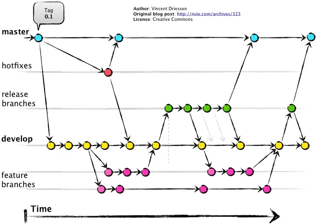

# Git

## Before committing, ensure that all code has been linted.

The application is pre-configured to lint your code.

If you are using the *VS Code Source Control* to interact with Git:
- run `npm run lint` before committing
- fix errors identified by the linter
- commit your changes

For a more robust approach, **it is recommended to use the console** to interact with Git. This ensures that unlinted code does not get into the repository, as all linting will be performed automatically:
- stage changes `git add .`
- commit changes `git commit -m 'Commit message'`
- here the linter will run automatically
- fix errors or if there are no errors, push changes to the repository `git push`

## Gitflow Workflow

Gitflow is a branching model for Git that organizes development into different branches:

1. **Master Branch:**
  - Represents the production-ready code.

2. **Develop Branch:**
  - Serves as a staging area for new features.
  - Code from feature branches is merged here.

3. **Feature Branches:**
  - Created for new features.
  - Merged back into the develop branch upon completion.

4. **Release Branches:**
  - Created when the develop branch is ready for release.
  - Used for final adjustments and bug fixes before merging into master and develop.

5. **Hotfix Branches:**
  - Used to quickly patch issues in the master branch.

Typical flow:

- **Developers start working on a new feature:**
  - They create a new branch for the feature (e.g., `feature/my-feature`).

- **Feature is complete:**
  - The feature branch is merged back into the develop branch.

- **Prepare for a release:**
  - A release branch (e.g., `release/1.0.0`) is created from the develop branch.
  - Any final adjustments and bug fixes for the release are made in this branch.

- **Release is ready:**
  - The changes from the release branch are merged into both master and develop branches.
  - The release branch is deleted.

- **Hotfix needed:**
  - A hotfix branch (e.g., `hotfix/1.0.1`) is created from the master branch.
  - The necessary changes are made and merged back into both master and develop branches.
  - The hotfix branch is deleted.
